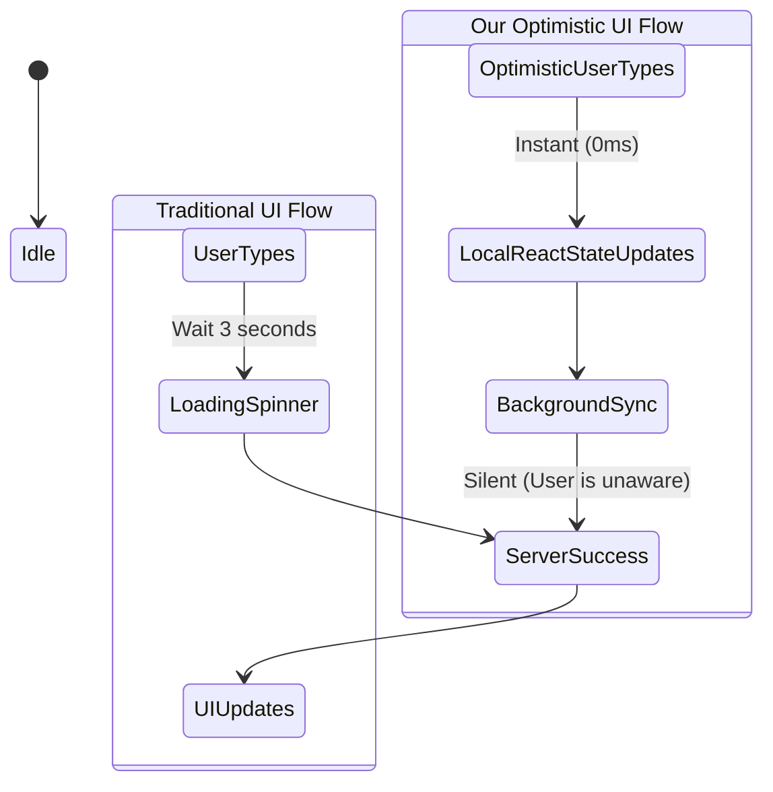

# State Management: Optimistic UI & Ghost Rows

The core challenge of relying on Google Sheets as a database is latency. A standard API write request to Google Apps Script can take anywhere from 1.5 to 3 seconds. In a modern web application, making a user wait 3 seconds after every keystroke or row creation is unacceptable.

We solved this using **Optimistic UI Updates**.

## What is Optimistic UI?
Optimistic UI is a frontend pattern that updates the interface immediately after a user action, assuming (optimistically) that the backend server request will eventually succeed.

## The "Ghost Row" Implementation
When a user wants to create a new task, they don't click a "New Form" button. They click an empty row at the bottom of the table.

1. **The Click Event:** The frontend generates a temporary UUID.
2. **State Injection:** An empty "Ghost Row" object is injected into the local `tasks` array.
3. **Instant Feedback:** The row appears instantly on screen, and the user's cursor is automatically focused into the title input.
4. **Background Sync:** A `POST` request is dispatched to `/api/admin/data` silently. Once Google Sheets assigns a true Row ID, the frontend quietly swaps the temporary UUID with the real Row ID.

## The Debounced Auto-Save Engine
If a user is typing a long task description, we cannot fire an API request for every single keystroke.

We built a custom React Hook (`useDebounce`) coupled with a localized `unsavedUpdates` Map.
- As the user types, changes are stored only in the local Map.
- A 1000ms timer starts. Every new keystroke resets the timer (debouncing).
- Once the user stops typing for 1000ms, the Map payload is converted to JSON and dispatched to the server.
- A small pill indicator in the UI transitions from `Saving...` to `Saved`.
