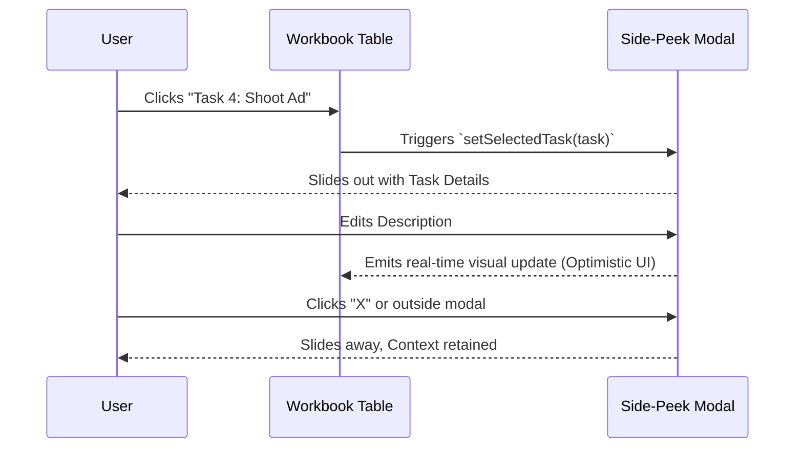

# Workflow Manual: The Notion-Style UI

The Admin Console Workbook (`/admin/workbook`) completely revolutionizes how TPC manages media production. By taking UX cues from Notion, we built an interface that is completely seamless, fast, and devoid of traditional forms and "Save" buttons.

## The Side-Peek Architecture

Traditional CRUD (Create, Read, Update, Delete) applications rely on full-page routing to edit records. This breaks user context.

To solve this, we implemented a **Side-Peek Slide-Out Modal**. 
When a user clicks on a task in the main workbook table, a sleek panel slides out from the right side of the screen.

### Benefits:
- **Context Retention:** The user can still see the main table timeline behind the modal.
- **Speed:** No full-page reloads.

## HTML5 Drag and Drop Reordering

Tasks and priorities change rapidly in an agency environment. We built a custom Drag and Drop engine using native HTML5 APIs rather than relying on heavy third-party libraries (like `dnd-kit` or `react-beautiful-dnd`).

1. **`onDragStart`**: Captures the index of the task being dragged.
2. **`onDragOver`**: Visually creates space where the task is hovering.
3. **`onDrop`**: Instantly mutates the local array (Optimistic UI) and dispatches a reordering payload to the backend to rewrite the Google Sheet indexes.

## Interactive Slash (`/`) Commands

To minimize mouse travel, the description editor supports Slash Commands. 

By typing `/` in the rich-text editor, a context menu appears. Users can rapidly type `/status done` or `/assign @john` to trigger state mutations without needing to scroll or click separate dropdown menus.
